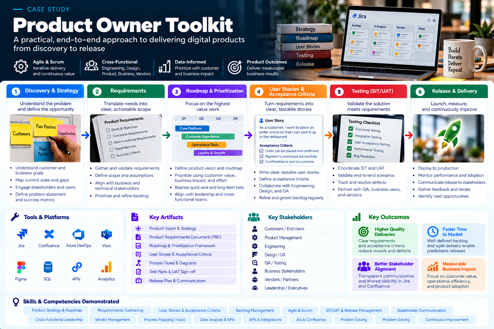

# Product Owner Toolkit

> **Portfolio artifact:** This toolkit summarizes the product practices documented across Roger Barahona’s professional experience. It contains no confidential employer artifacts or proprietary information.

## Overview

My product approach is built around a simple principle:

**Understand the problem → align on outcomes → translate needs into clear requirements → prioritize the work → enable delivery → validate readiness.**

Across Product Ownership and Business Analysis roles, I have used roadmaps, requirements, prioritized backlogs, user stories, acceptance criteria, SIT/UAT, stakeholder alignment, and release support to move complex initiatives from business need toward delivery.

This toolkit shows how those practices fit together.

## 1. Problem & Requirement Discovery

Before defining a solution, establish:

- What business or operational problem needs to be addressed?
- Who is affected?
- What outcome is expected?
- What systems, channels, markets, or workflows are involved?
- What dependencies or constraints need to be understood?

The goal is to create a shared definition of the problem before teams commit to implementation.

## 2. Roadmap & Prioritization

My documented Product Owner experience includes defining product roadmaps and prioritizing backlogs.

A practical prioritization conversation considers:

| Question | Purpose |
| --- | --- |
| What problem does this solve? | Keeps work tied to a real need |
| Who is affected? | Clarifies users and stakeholders |
| What is the expected outcome? | Creates a basis for success |
| What dependencies exist? | Exposes delivery complexity |
| What must happen first? | Supports sequencing |
| Is the requirement clear enough to build and test? | Protects delivery readiness |

## 3. Engineering-Ready User Stories

A useful story should give the delivery team enough context to understand the user need and intended outcome.

**Example structure**

**As a** [user or stakeholder]  
**I want** [capability]  
**So that** [business/user outcome]

The story should be supported by requirements, context, dependencies, and acceptance criteria rather than relying on the sentence alone.

## 4. Acceptance Criteria

Acceptance criteria create a shared definition of expected behavior and provide a foundation for development and testing.

Good criteria should be:

- Specific
- Observable
- Testable
- Connected to the requirement
- Clear about important conditions and expected outcomes

## 5. Backlog Readiness

Before work moves toward delivery, I look for enough clarity around:

- Business need
- Requirement
- User story
- Acceptance criteria
- Dependencies
- Stakeholder alignment
- Testing considerations
- Release implications

The objective is not documentation for its own sake. It is reducing ambiguity before that ambiguity becomes rework.

## 6. SIT & UAT

My documented experience includes coordinating **System Integration Testing (SIT)** and **User Acceptance Testing (UAT)**.

These activities help validate two different questions:

**SIT:** Do the connected systems and integrations behave as expected?

**UAT:** Does the delivered solution satisfy the intended business need and expected user behavior?

## 7. Release Readiness

Release support connects the original requirement with what is actually going into production.

Key considerations include:

- Required testing completed
- Material defects understood
- Dependencies accounted for
- Stakeholders aligned
- Expected behavior validated
- Deployment/release considerations understood

## 8. Stakeholder Communication

Complex product environments require translation between business, operations, product, and technology.

My role has repeatedly involved turning stakeholder needs into requirements that delivery teams can act on while maintaining alignment throughout testing and release activities.

## Where I Have Applied These Practices

These practices are grounded in documented work across:

- A **30,000+ restaurant** global POS and omnichannel ecosystem at Subway
- Uber Eats and DoorDash POS integrations
- Restaurant technology deployments across LATAM and the Caribbean
- A JM Family distribution ecosystem serving **178 independent Toyota dealerships**
- A Microsoft Dynamics 365 transformation involving **30+ integrations**
- Software lifecycle and requirements work at LTM

## Skills Demonstrated

Product Ownership · Requirements Gathering · Product Roadmaps · Backlog Prioritization · User Stories · Acceptance Criteria · SIT · UAT · Release Planning · Stakeholder Management · Cross-Functional Delivery · Agile · Scrum · SAFe

---

[← Back to Roger Barahona's GitHub profile](../../)

**Explore my interactive portfolio:** [rogerbarahona.com](https://rogerbarahona.com)
